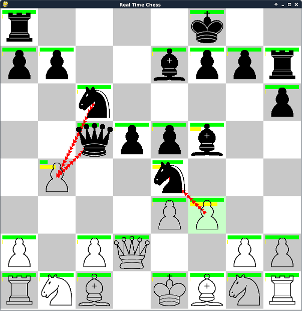

Open Real-Time Chess (ORTC)
====

Rules
-----
The ancient game you all love is now a lot faster! Every piece may attack and
move simultaneously. Once a piece has moved it has to wait for a fixed amount of
time (yellow bar) but it can always attack. If the hitpoints of a piece (green
bar) are reduced to zero, the piece is removed from the board. While attacking,
a piece may switch targets at any time. 

Strategy
--------
* Hitpoints generate slowly over time so a strategic withdrawal is often a good idea.
* Some pieces have more hitpoints than others. If a pawn attacks the King, the
  King can fight back and win!
* Attacking and defeating a piece causes a piece to move to the victims location
  regardless of the current move delay. This can be used to get out of a tight
  spot.

Game Modes
----------
Out of the box, only play vs. AI is supported. The AI always plays as *Black*
but this is quite irrelevant for ORTC since both players move simultaneously
anyway and there is no disadvantage to playing *Black*.

Requirements
------------
* python 2.7 (python.org)
* pygame (pygame.org)
* chess engine stockfish (stockfishchess.org) accessible via commandline 'stockfish'

Customization
-------------
The game can be customized by modifying values in `parameters.py`.
 * `SPEED` : Game speed in general
 * `AI_DELAY` : Minimum delay between AI moves (correlates strongly with difficulty)
